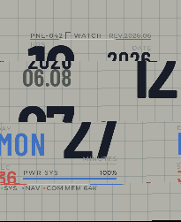
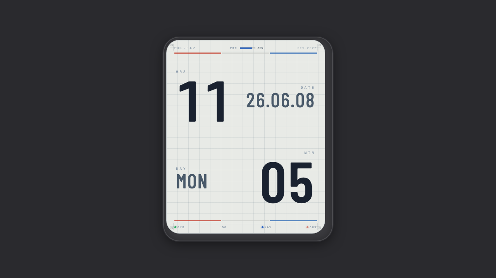

# Pragmata Watch

基于 ESP32-S3 的开源智能手表固件，使用 [Gadgetbridge](https://gadgetbridge.org/) 协议通过 BLE 与手机连接。

## 硬件

- **开发板**: Waveshare ESP32-S3 Touch AMOLED 2.06"
- **MCU**: ESP32-S3 (240MHz 双核, 16MB Flash, PSRAM)
- **屏幕**: 1.91" AMOLED, 410×502 分辨率
- **触摸**: FT5x06 电容触摸
- **RTC**: PCF85063
- **电池**: 内置锂电池 + 电量监测

## 界面预览

### 表盘

| 设备实截图 | 设计预览 |
|:---:|:---:|
|  |  |

## 功能

| 模块 | 说明 |
|------|------|
| 表盘 | 数字时钟 + 日期显示 + AOD |
| BLE 连接 | NimBLE 协议栈, Just Works 配对 |
| Gadgetbridge | 通知推送/删除、来电提醒、时间同步、闹钟同步 |
| 通知中心 | 来电、消息等通知的 UI 展示与 dismissing |
| 闹钟 | 从 Gadgetbridge 同步闹钟, NVS 持久化存储 |
| 应用中心 | 3×3 图标网格布局的应用启动器 |
| 设置 | 设备设置界面 |

## 目录结构

```
main/
├── main.c              # 入口, 初始化各模块
├── watch_face.c/h      # 表盘 UI
├── app_manager.c/h     # 应用管理框架
├── app_launcher.c/h    # 应用中心启动器
├── alarm_manager.c/h   # 闹钟存储与提醒
├── battery.cpp/h       # 电池电量读取
├── rtc_pcf85063.c/h    # RTC 驱动
├── screenshot.c/h      # 屏幕截图工具
├── ble/
│   ├── ble_manager.c/h         # BLE 初始化与 GAP/GATT 管理
│   ├── ble_nus.c/h             # Nordic UART Service (数据传输)
│   └── ble_gadgetbridge.c/h    # Gadgetbridge 协议解析
├── ui/
│   └── notification_ui.c/h     # 通知弹窗 UI
├── apps/
│   └── app_settings.c/h        # 设置应用
└── fonts/
    └── font_chinese_16.c       # 中文字体 (16px)
```

## 开发环境

- **框架**: ESP-IDF v5.4.2
- **UI**: LVGL (通过 esp_lvgl_port)
- **BSP**: Waveshare esp32_s3_touch_amoled_2_06 组件
- **BLE**: NimBLE (Nordic UART Service)

## 编译与烧录

```bash
# 编译
idf.py build

# 烧录 (替换为实际端口)
idf.py -p /dev/cu.usbmodem*** -b 115200 flash

# 监视串口输出
idf.py -p /dev/cu.usbmodem*** monitor
```

## 手机连接

1. 安装 [Gadgetbridge](https://gadgetbridge.org/) (Android)
2. 在 Gadgetbridge 中搜索并配对设备
3. 配对后自动同步时间、通知和闹钟

## 依赖

依赖通过 `idf_component.yml` 管理，编译时自动下载到 `managed_components/`：

- `waveshare/esp32_s3_touch_amoled_2_06` — BSP
- `lvgl/lvgl` — UI 框架
- `espressif/esp_lvgl_port` — LVGL 移植层
- `espressif/esp_lcd_touch_ft5x06` — 触摸驱动
- `waveshare/pcf85063a` — RTC 驱动
- `cube32esp/xpowerslib` — 电源管理

## License

MIT
